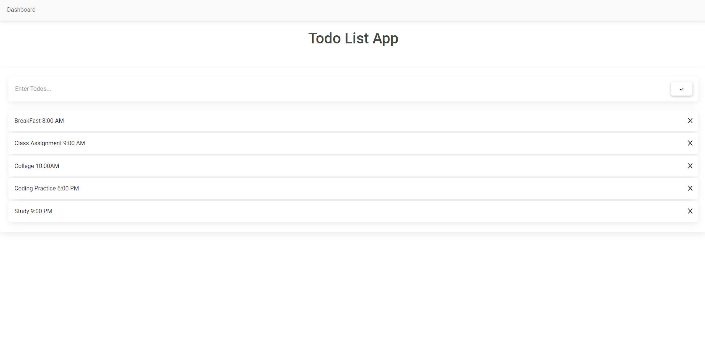

# Todo List App

A Mater design modern Todo List Web App, where a user can add their todos and can remove after completion.
Todo List App is made using pure Vue.js Framework in additon of Sass styling.


## Demo

https://todo-list0-vue.netlify.app/


## Features

- Easy and Light weight
- Cross platform
- Single Page Application
- Fully Responsive
- Todos can be Added and can be removed easily
- No empty Todos are allowed 
- No duplicate Todos are allowed
- For Change check out at:
```bash
  cd ./src/components
  nano ./Heros.vue
```
- At line 43, and make change:
```bash
  this.newHero = newHero;
```


## Screenshots



## Clone the project

```bash
  git clone https://github.com/badass1901/Job-Portal
```

## Project setup

```
yarn install
```

### Compiles and hot-reloads for development
```
yarn serve
```

### Compiles and minifies for production
```
yarn build
```

### Lints and fixes files
```
yarn lint
```

## Deployment

To deploy this project run

```bash
  npm run deploy
```
## 🛠 Tools
- Vue js
- Node


## Support

For support, email shashwatsagar19@gmail.com or visit https://shashwatsagar.netlify.app

